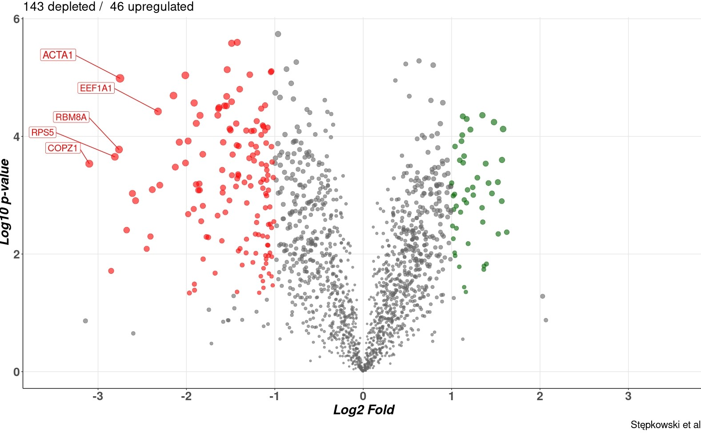

## Data preparation
### Introduction
 To prepare the vulcano plot like this: which is a special type of a scatter plot we need a dataframe type of data with at least two variables inside - Log2 fold change and -log10 p-value for reads of particular genes/proteins. For additional labeling of points we will need a gene/protein name variable. Too assign categorical variables to points we will need a column(variable) of data type - factor. If a file imported from excel contains a character string variable with categorical data we will need to change it to factor data type with as.factor() function. To analyze the structure of dataframe showing which datatypes are present inside the dataframe we use function str() from base or glimpse() from the "dplyr" library. The data type of a particular object can be checked by class() function. To install a particular library use install.packages("library_name") command. To downlaoad the functions availible in an installed library use library("name") command. For every function a help page is availible - just type ?function_name() in the console and the help page will appaer. For efficient processing in R data should be in a tidy format which is understood as a dataframe(table) in which every row is an observation and each column is a variable.      
    
### Importing raw dataset

The data can be imported from excel with the function read_excel() availible in library(readxl). Similar functions exist for importing data from csv and tab deligned textfiles. THe # sign eneables commenting the code - everything after would not be executed... 

```{r}
# The file Table2.xls is an example processed data from highthrouput biological experiment. The name was changed to Pilot_TMT_RAW. The file contains log2 fold changes and adjusted p- values for the comparison A vs. control and B vs. control 
# Import full DataSet from Excel

library(readxl)
Pilot_TMT_RAW <- read_excel("Pilot_TMT_RAW.xlsx")

```
### The structure of the raw data

The following table contains data from first 10 observations of the Pilot_TMT_RAW dataframe. For our needs the data is "tidy" because we will use only A part for demonstaratory purposes. To efficiently process and compare the entire data it would be a good idea to convert Control/B/A as an aditional variable column "treatment" and combine some other variables. We will not do it here...
```{r paged.print=TRUE}
#First ten observation to visualise the structure of the raw data 
head(Pilot_TMT_RAW)
```

The R representation of the structure of the dataframe - the $ sign represents different variables(columns) it is followed by datatype (here num - numeric , chr - character string) and number of observations.

```{r}
# Dataset contains 1663 uniqe observations (different proteins/genes)
str(Pilot_TMT_RAW)
```

### Extracting the neccesarry information to create the Vulcan

Let`s create a new dataframe with neccesary data for genes, p_value and log2 difference...Library(dplyr) provides the  pipe operator : %>% . It basically means that the code on the left "feeds" the code on its right and eneables creating data proccessing piplines in a claen and readible format.

```{r message=FALSE, warning=FALSE}
# Library dplyr for efficient data wrangling in R
library(dplyr)
# New data frame containing only the data neccesary for  A vs. Control Vulcan - gene names, p-value and fold difference.
Data_for_Vulcan <-  Pilot_TMT_RAW %>% 
                    # This is how we select columns variables from Pilot_TMT_RAW - it does not have to be beetween `` 
                    select(`Gene names`,`negLog p-value A_vs_Control`,`T-test Difference A_vs_Control`) %>%
                    # renaming column names to the more readeble alternatives
                    rename(genes = `Gene names`,p_value = `negLog p-value A_vs_Control`,Logdiff = `T-test Difference A_vs_Control`)


# Structure of the created dataframe
str(Data_for_Vulcan)

```

### Creating new factor variable neccesary for demonstration of displaying factor categories on the vulcano plots

 Lets create some new columns that will inform us wheter the particular gene codes for complex I accesory subunit or ribosomes subunits is biologically significant and belongs to an arbitrary category. For creating a new column we use mutate() function. Inside we name the columns
ex. New column "Category" was created and the result of case_when() function were assigned to it. Inside case_when() grepl() search for gene names starting with NDUF or RPS or RPL. For easy ploting we should change the data type of this new column to a factor type with as.factor() function.  


```{r}
# Creating factor "Complex_I"  for genes contaning "NDUF" in their names and "Ribosome_large_subunit_" and "Ribosome_small_subunit" for genes containing RPSorRPL+number in their names

Data_for_Vulcan <- Data_for_Vulcan %>% mutate(Category = case_when(
                                                   grepl("NDUF.*", genes) ~ "Complex_I",
                                                   grepl("RPS.*", genes) ~ "Ribosome_small_subunit",
                                                   grepl("RPL.*", genes)~ "Ribosome_large_subuinit",
                                                   TRUE~ "Other")
                                               )

# Changing Category variable datatype from character into factor
Data_for_Vulcan$Category <- as.factor(Data_for_Vulcan$Category)

# Displaying counts of different factor categories of Category variable
table(Data_for_Vulcan$Category)


# Creating a new column for significant results with fold x 2 and p-value < 0.05

# Recalculating log p - value
p_value <-  0.05
logp_value <- log10(p_value) # = -1.30103
# Undo log:
print(paste("p_value treshold is set up as", 10^logp_value)) # = 0.05  - the log10 for 0.05 is ~ -1.3 

                   #ifelse(test, co zrobić jak true, co jak false)
Data_for_Vulcan <- Data_for_Vulcan %>% mutate(Significant = case_when(
                                          #Creating categories
                                          Logdiff < - 1 & p_value > 1.30103 ~ "Depleted",
                                          Logdiff > 1 & p_value > 1.30103 ~ "Upregulated" ,
                                          Logdiff > -1 | Logdiff < 1~ "Not-Significant"
                                                                     )  
                                              )
# Changing to factor datatype
Data_for_Vulcan$Significant <- as.factor(Data_for_Vulcan$Significant)
# Lets see how many are significant
table(Data_for_Vulcan$Significant)

# Additional column to demonstrate collor palletes (devides the observations equally to numbers 1,2,3,4,5,6)
Data_for_Vulcan <- Data_for_Vulcan %>% mutate(Set = case_when(
                                        row_number()%in% 1368:1663 ~ "Color_1",
                                        row_number()%in% 1091:1367 ~ "Color_2",
                                        row_number()%in% 814:1090 ~ "Color_3",
                                        row_number()%in% 537:813 ~ "Color_4",
                                        row_number()%in% 260:536 ~ "Color_5",
                                        row_number()%in% 1:259 ~ "Color_6"
                                                              )
                                              )  
 str(Data_for_Vulcan)
 table(Data_for_Vulcan$Set)
```
## Creating vulcano plot step by step

Library(ggplot2) is the most commonly used and a really powerful r library for data visualisation. It is based on the paradigm of grammar of graphics in which visualisations objects are build step by steb by introducing subseqent layers of information. We start creating a plot by calling ggplot() function in which we define the data source and basic aestetics aes() of cartesian cordinates(x,y etc.) which tells R how to represent data on the plot. Then we add geoms such as points (geom_point(), histogram - geom_hist() etc. It is important to highligh that every layer of ggplot2 object may inherit aestetics from the previous layer or have its own defined for example color based on categorical variable. It is  also importand to distinguish aestetics and atributes. Aestetics are put in side aes() function and tell R how to display anything based on data, the atributes are introduced outside aes() and are purely graphical not based on data. The structure of the plot looks like that:

    Name of the plot object <- ggplot(data = Table_1, aes(x = Column_1, y = Column_2, color = anyVariable))+
                               geom_point(color = "green", size = 12)
            
Here color and size inside geom_point() are atributes not aestethics. The color = anyVariable is an aestetic declaration which will color some points according to data in a particular column. 

### Createing very basic vulcano plot with ggplot2 library and controling for overplotting

Below is a very basic vulcano plot created in ggplot2 by geom_point() function. To make it publishable quality we need to customise a little:

1. Control for overplotting - by introducing small random noise to points position(jittering) or using alpha transparency of points
2. We need to set proper title, subtitle and axis titles as well as legend
3. We need to color the points that are statistically significant
4. We need to change the x axis to be symetrical so it will be easy for the reader to compare up and downregulated protein/genes
5. We may color the points for an interesting category of proteins/genes
6. We may atribute the size and color artibutes of points to highlight the most imortant results
7. We may introduce a custom scientific journal color pallete 
8. We should modify or remove the default plot background
9. We should increase the fonts to be big enough for a particular output
   

```{r}
# Basic Vulcano plot with ggplot2 library

library(ggplot2)


#Library for creating a graphics grid
library(gridExtra)

Basic_Vulcan <- ggplot(Data_for_Vulcan, aes(x = Logdiff , y = p_value))+
                geom_point()+
                #This is how we introduce the plot title
                labs(title = "Basic default Vulcan")

Basic_Vulcan_jitter <- ggplot(Data_for_Vulcan, aes(x = Logdiff , y = p_value))+
                       geom_jitter()+
                       labs(title = "Jittering introduced")

Basic_Vulcan_transparent_points <- ggplot(Data_for_Vulcan, aes(x = Logdiff , y = p_value))+
                                   geom_point(alpha = 0.5)+
                                    labs(title = "Transparency introduced")

Basic_Vulcan_transparent_points_jittered <- ggplot(Data_for_Vulcan, aes(x = Logdiff , y = p_value))+
                                            geom_jitter(alpha = 0.5)+
                                            labs(title = "Transparency and jittering introduced")

# arrange plots into two rows and two columns
Set_1 <- grid.arrange(Basic_Vulcan, Basic_Vulcan_jitter, Basic_Vulcan_transparent_points, Basic_Vulcan_transparent_points_jittered, ncol = 2, nrow = 2 )
```


### Creating equall sized x scales and fixing aspect ratio of the plots
  Whe may fix the aspect ratio with coord_fixed() if we would like to compare different datasets and easly arrange them in a   grid layout of multiple rectangles with the same scales. 

```{r}
# limit and breaks of the x axis
Basic_Vulcan_scale <- Basic_Vulcan_transparent_points_jittered + 
                      scale_x_continuous(limits = c(-3.5, 3.5),
                                         breaks = c(-3.5, -3,-2,-1,1,2,3, 3.5))
                                 
    
#  Whe may fix the aspect ratio with fixed scales if we would like to compare different datasets abd easly arrange them in a grid layout of multiple squares 

Basic_Vulcan_squareshape <- Basic_Vulcan_scale +
                            coord_fixed(ratio = 1/1) +
                            labs(title = "Fixed aspect ratio 1/1")


grid.arrange(Basic_Vulcan_scale, Basic_Vulcan_squareshape, ncol=2)
```

### Assigning categories to points
    Categorical data may be represented as color, shape , size and transparency but it is adviced to use discrete colors

```{r}
# Assigning colors for significant hits

Basic_Vulcan_colored_categories <-  ggplot(Data_for_Vulcan, aes(x = Logdiff , y = p_value, col = Significant))+
                                    geom_jitter(alpha = 0.5)+
                                    scale_x_continuous(limits = c(-3.5, 3.5),
                                                       breaks = c(-3.5, -3,-2,-1,1,2,3, 3.5))+
                                    coord_fixed(ratio = 1/1)+
                                    labs(title = "Up/Down regulated in color")+
                                   # changing colors 
                                    scale_color_manual(values = c("red","gray50", "green"), na.translate = TRUE)
  
  # Ovverriding alpha transparency for significant hits and assigning custom color by creating second layer of points
  Basic_Vulcan_colored_categories_2 <-  ggplot(Data_for_Vulcan, aes(x = Logdiff , y = p_value), color = "gray20")+
                                        geom_jitter(alpha = 0.5)+
                                        scale_x_continuous(limits = c(-3.5, 3.5),
                                                           breaks = c(-3.5, -3,-2,-1,1,2,3, 3.5))+
                                        coord_fixed(ratio = 1/1)+
                                        labs(title = "Overide color layer")+ 
    
  # Additional layers of points only for particular categories 
             geom_point(data = Data_for_Vulcan[Data_for_Vulcan$Significant == "Depleted" , ],
                        color= "red")+
             geom_point(data = Data_for_Vulcan[Data_for_Vulcan$Significant == "Upregulated" , ],
                        color= "green")


   #setting up colors according to biomit guidelines (Red- depleted , Green - upregulated)

Basic_Vulcan_colored_categories
Basic_Vulcan_colored_categories_2
```

### Assigning size atribute to points to highliting most important results

  You can assign size atribute to points dependant on fold, p. value or both so that the most important resulats become bigger points.
  
  
```{r}

# Introducing size atribute for Logdiiff x squared p-value

Vulcan_size_highliting <- ggplot(Data_for_Vulcan, aes(x = Logdiff ,
                                                      y = p_value, 
                                                      col = Significant,
                                                      size = abs(Logdiff*p_value)))+
                                  geom_jitter(alpha = 0.5)+
                                  scale_x_continuous(limits = c(-3.5, 3.5),
                                                     breaks = c(-3.5, -3,-2,-1,1,2,3, 3.5))+
                                  coord_fixed(ratio = 1/1)+
                                  labs(title = "The more important the bigger")+
  # changing colors 
                                  scale_color_manual(values = c("red","gray50", "darkgreen"), 
                                                     na.translate = TRUE)

Vulcan_size_highliting 
```
  

### Displaying categorical data on vulcano plots
  The default point produced by geom_point() function has only the color atribute  - the ones with numbers from 21 have also fill atribute - by combining both it is possible to plot two types of categorical data at once for example - all the significant hits that belong to complex I category. However it may be more explanatory to create two faceted plots one be one in such a case or use shape attribute.
```{r echo=FALSE}
# Function for displaying point shapes availible in R
generateRPointShapes<-function(){
  oldPar<-par()
  par(font=2, mar=c(0.5,0,0,0))
  y=rev(c(rep(1,6),rep(2,5), rep(3,5), rep(4,5), rep(5,5)))
  x=c(rep(1:5,5),6)
  plot(x, y, pch = 0:25, cex=1.5, ylim=c(1,5.5), xlim=c(1,6.5), 
       axes=FALSE, xlab="", ylab="", bg="blue")
  text(x, y, labels=0:25, pos=3)
  par(mar=oldPar$mar,font=oldPar$font )
}
generateRPointShapes()
```


```{r}
# Displaying two categorical variables with color and shape
Vulcan_categorical <- ggplot(Data_for_Vulcan, aes(x = Logdiff ,
                                                  y = p_value, 
                                                  shape = Significant,
                                                  size = abs(Logdiff*p_value),
                                                  color = Category))+
                      geom_jitter(alpha = 0.6)+
                      scale_x_continuous(limits = c(-3.5, 3.5),
                                         breaks = c(-3.5, -3,-2,-1,1,2,3, 3.5))+
                      coord_fixed(ratio = 1/1)+
                      labs(title = "Different shapes and colors for categories")

Vulcan_categorical
```

```{r}

#When displaying two categorical variables with color and fill you must use shape numbers from 21 to 25
Vulcan_categorical_fill_color <- ggplot(Data_for_Vulcan, aes(x = Logdiff,
                                                             y = p_value,
                                                             size = abs(Logdiff*p_value),
                                                             fill = Category,
                                                             color = Significant))+
                                  geom_jitter(alpha = 0.6, shape = 21)+
                                  scale_x_continuous(limits = c(-3.5, 3.5),
                                                     breaks = c(-3.5, -3,-2,-1,1,2,3, 3.5))+
                                  coord_fixed(ratio = 1/1)+
                                  labs(title = "Category by fill, Significant by color")+
  # Different color scales must be used to distinguish fill and color 
                                  scale_color_manual(values = c("red","gray90","darkgreen"))+
                                  scale_fill_manual(values = c("yellow", "gray50", "orange", "purple"))+
                                 # different theme background
                                  theme_minimal()
  
  
Vulcan_categorical_fill_color
```


### Introducing custom color scales from scientific journals such as Nature of Lancet 
     Library(ggsci) provides color palletes used by top tier biomedical journals. Here are some examples:

```{r}
#scientific palletes
library(ggsci)
                                              #display only a sample of 200 points
Vulcan_custom_colors <- ggplot(Data_for_Vulcan[sample(1:1663, 200), ],
                               aes(x = Logdiff ,
                                   y = p_value,
                                   size = abs(Logdiff*p_value),
                                   col = Set,
                                   shape = Significant))+
                        geom_jitter(alpha = 0.6 )+
                        scale_x_continuous(limits = c(-3.5, 3.5),
                                           breaks = c(-3.5, -3,-2,-1,1,2,3, 3.5))+
                        coord_fixed(ratio = 1/1)+
                        labs(title = "Default pallete")+
                        # striping axis and background and legends
                        theme_void()+
                        theme(legend.position = "none")

# Some examples of colors palletes availible in ggsci:

  # Nature color pallete 
Vulcan_colors_nature <- Vulcan_custom_colors + scale_color_npg()+
                        labs(title = "Nature pallete")
  # Lancet color pallete 
Vulcan_colors_Lancet <- Vulcan_custom_colors + scale_color_lancet()+
                        labs(title = "Lancet pallete")
  #  Star trek color pallete 
Vulcan_colors_startrek <- Vulcan_custom_colors + scale_color_startrek()+
                        labs(title = "Star trek pallete")
# New England Journal of Medicine pallete
Vulcan_color_nejm <- Vulcan_custom_colors + scale_color_nejm()+
                        labs(title = "NEJ. of Medicine pallete")
# UCSC genome browser pallete
Vulcan_color_ucsc <- Vulcan_custom_colors + scale_color_ucscgb()+
                        labs(title = "UCSC genome browser pallete")

grid.arrange(Vulcan_custom_colors, Vulcan_colors_nature, Vulcan_colors_Lancet, Vulcan_colors_startrek, Vulcan_color_nejm,Vulcan_color_ucsc, nrow =2, ncol =3)
```

### Introducing labels for gene names

The labels for gene/protein names can be introduced by geom_text() [pure text] or geom_label() functions [color label].
Lets name five genes with the biggest Fold*p_value (biggest points on the plot):

#### Problems with geom_text() and geom_label()

geom_label produce nice labels but they are often one on top of another. We can modify the size and nudge of the labels but for purpose of vulcano plots it is convinient to use the geom_label_repel or geom_text_repel additional functions provided by the ggrepel library (https://cran.r-project.org/web/packages/ggrepel/vignettes/ggrepel.html)

```{r}

# FIltering the top 5 observation based on absolute Fold*p_value 

Data_for_Labels <- Data_for_Vulcan %>% mutate(importance = abs(Logdiff)*p_value) %>%
                                       arrange(importance) %>%
                                       top_n(5)
Data_for_Labels

# Shortening genes names by regular expression catching anything until ;
Data_for_Labels$genes <- sub("\\;.*", "", Data_for_Labels$genes) 


# Adding labels from addtional dataframe  
Vulcan_labels <- Vulcan_size_highliting + geom_label(data = Data_for_Labels, aes(label = genes))+
                                          labs(title = "some labels added but they overlap...")
  
Vulcan_labels
```

#### Geom_label_repel()
  
```{r}
library(ggrepel)

Vulcan_repels <- Vulcan_size_highliting + geom_label_repel(data = Data_for_Labels,
                                                           aes(label = genes, fill = as.factor(Category)))+
                                          labs(title = "some label repels added but they still overlap...")
Vulcan_repels
```

### Polishing the plot for publication quality
    For publication ready plot we should increase the font size of axis ticks and labels,  erase some legends and create meaningfull titles and subtitles as well as delicate grid background.
    
#### The theme() function eneables customisation of non-data elements of the plot
In ggplot there are some predefined themes such as theme_bw() or theme_minimal() for nice printable plots. However by using theme() you can create your own custom plot appearance. If you wrap it in a function you will be able to use it later for as many plots as you would like. 

We modify the plot by arguments of theme() function by atributing their properties to a particular element_X() function call. For example to strip the background we use theme(plot.background = element_blank())  
  
##### Demonstration of different predefined ggplot2 themes
```{r}
# striping legends
Vulcan_size_highliting <- Vulcan_size_highliting + guides(color = FALSE, fill = FALSE, size = FALSE)
    
Vulcan_BW <- Vulcan_size_highliting + theme_bw()+labs(title = "Black and White")
Vulcan_Classic <- Vulcan_size_highliting + theme_classic()+labs(title = "Classic")
Vulcan_Void <- Vulcan_size_highliting + theme_void()+labs(title = "Void")
Vulcan_Minimal <- Vulcan_size_highliting + theme_minimal()+labs(title = "Minimal")
Vulcan_Light <- Vulcan_size_highliting + theme_light()+labs(title = "Light")
Vulcan_Dark <- Vulcan_size_highliting + scale_color_manual(values = c("red", "yellow", "green"))+ 
               theme_dark()+labs(title = "Dark")

Vulcan_BW
Vulcan_Classic
Vulcan_Void
Vulcan_Minimal
Vulcan_Light
Vulcan_Dark
```

##### Modifying size of the axis ticks and labels

The classic theme looks publishable but we should modyfie it a little bit:

This is how we increase the size of the font in axis title and labels:

```{r}
#Increasing the size of the axis 
Vulcan_axis_increased <- Vulcan_Classic+theme(axis.text = element_text(size=12, face = "bold"),
                                              axis.title = element_text(size=15, face ="bold.italic"))

Vulcan_axis_increased
```

## The Final publication quality plot 
 The code for all the steps to create a plot. The plot object can than be exported in Rstudio in to pdf, svg and different types of image files with whatever size and dpi.     
    
```{r fig1, fig.height = 8, fig.width = 16}

Vulcan_publication <- ggplot(Data_for_Vulcan, aes(x = Logdiff ,
                                                  y = p_value,
                                                  color = Significant,
                                                  size =  abs(Logdiff*p_value*2)))+
                         geom_jitter(alpha = 0.6)+
                         scale_x_continuous(limits = c(-3.5, 3.5),
                                            breaks = c(-3:3))+
                        coord_fixed(ratio = 2/3)+
                        # Adding apropriete titles and subtitles
         labs(title = "Treatment A vs. Control",
                       subtitle = "143 proteins depleted / 46 upregulated [Fold > 2 , p_value > 0.05]",
                       caption  = "Stępkowski et al." )+
                      #axis labels
                         ylab( "Log10 p-value")+
                          xlab( "Log2 Fold")+
                      # changing colors 
                      scale_color_manual(values = c("red","gray40", "darkgreen"), na.translate = TRUE)+
                      # labels for top 5 genes 
                      geom_label_repel(data = Data_for_Labels,
                                      aes(label = genes),
                                     # label position adjustment,
                                      nudge_x = -0.7,
                                      nudge_y = 0.4,
                                      force = 4
                                      )+
  
                        # do not show legends
                        guides(color = FALSE, size = FALSE)+
  
                      # theme customisation
                        theme_classic()+
                        theme(axis.text = element_text(size=20, face = "bold"),
                            axis.title = element_text(size=22,face="bold.italic"),
                            title = element_text(size=21),
                      # adding minir gridlines
                             panel.grid.major =  element_line(colour="gray90", size=0.5)
                            ) 
Vulcan_publication
```

A Vulcan with categorical data

```{r fig2, fig.height = 8, fig.width = 16}
Vulcan_Publication_2 <-   ggplot(Data_for_Vulcan,
                          aes(x = Logdiff ,
                              y = p_value, 
                              size = abs(Logdiff*p_value*2),
                              color = Category))+
                        geom_jitter(alpha = 0.6)+
                        scale_x_continuous(limits = c(-3.5, 3.5),breaks = c(-3:3))+
                        coord_fixed(ratio = 2/3)+
                        # Adding apropriete titles and subtitles
                        labs(title = "Treatment A vs. Control",
                           subtitle = "Complex I and Ribosomal proteins",
                           caption  = "Stępkowski et al.")+
                      # Axis labels
                        ylab( "Log10 p-value")+
                        xlab( "Log2 Fold")+
                      # changing colors 
                      scale_color_manual(values = c("orange", "gray60", "blue","red"))+
                      # labels for top 5 genes 
                      geom_label_repel(data = Data_for_Labels,
                                       aes(label = genes),
                                       #label position adjustment
                                       nudge_x = -0.7,
                                       nudge_y = 0.4,
                                       force = 4
                                       )+
  
                      # do not show size legends
                      guides(size = FALSE)+
  
                      # theme customisation
                      theme_classic()+
                      theme(axis.text = element_text(size=20, face = "bold"),
                            axis.title = element_text(size=22,face="bold.italic"),
                            title = element_text(size=21),
                      # adding minor gridlines
                             panel.grid.major =  element_line(colour="gray90", size=0.5),
                      # Increasing the legend keys
                             legend.key.size = unit(1,"cm"),
                             legend.key = element_rect(fill = c("orange", "gray60", "blue","red")),
                             legend.text = element_text(size = 18),
                      # removing legend title and rectangles around keys
                            legend.title = element_blank(),
                            # moving legend to bottom
                      
                            )       

Vulcan_Publication_2
```

## Custom ploting function

 Lets wrap the above code in a custom ploting function create_vulcan()that could be used for different datasets:
 
```{r fig3, fig.height = 8, fig.width = 16}

#
create_vulcan <- function(data,
                          xlogs, 
                          ypval,
                          names,
                          categorical,
                          title = "title", 
                          subtitle = "subtitle",
                          caption = "caption"){ library(dplyr)
    #Arguments data = dataframe, xlogs = column with logs, ypval = column with p_values, categorical 
                  #creating size column 
                          
                          #this function works only with aes_string and arguments must be passed with "" 
   return(ggplot(data, aes_string(x = xlogs,
                              y =ypval, 
                              color = categorical))+
                        geom_jitter(alpha = 0.6)+
                        scale_x_continuous(limits = c(-3.5, 3.5),breaks = c(-3:3))+
                        coord_fixed(ratio = 2/3)+
                        # Adding apropriete titles and subtitles
                        labs(title = title,
                           subtitle = subtitle,
                           caption  = caption)+
                      # Axis labels
                        ylab( "Log10 p-value")+
                        xlab( "Log2 Fold")+
                      # changing colors 
                      scale_color_manual(values = c("orange", "gray60", "blue","red"))+
                      # labels for top 5 genes 
                      geom_label_repel(data = Data_for_Labels,
                                       aes_string(label = names),
                                       #label position adjustment
                                       nudge_x = -0.7,
                                       nudge_y = 0.4,
                                       force = 4
                                       )+
  
                      # do not show size legends
                      guides(size = FALSE)+
  
                      # theme customisation
                      theme_classic()+
                      theme(axis.text = element_text(size=20, face = "bold"),
                            axis.title = element_text(size=22,face="bold.italic"),
                            title = element_text(size=21),
                      # adding minor gridlines
                             panel.grid.major =  element_line(colour="gray90", size=0.5),
                      # Increasing the legend keys
                             legend.key.size = unit(1,"cm"),
                             legend.key = element_rect(fill = c("orange", "gray60", "blue","red")),
                             legend.text = element_text(size = 18),
                      # removing legend title and rectangles around keys
                            legend.title = element_blank(),
                            # moving legend to bottom
                      
                            ) )      
  }


create_vulcan(Data_for_Vulcan , "Logdiff", "p_value", "genes", "Category", title = "Nice title", subtitle = "Nice subtitle", caption = "Iksiński et. al")


```
 


